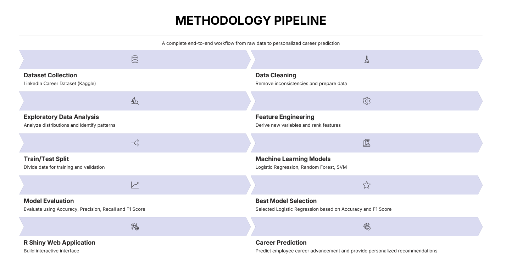
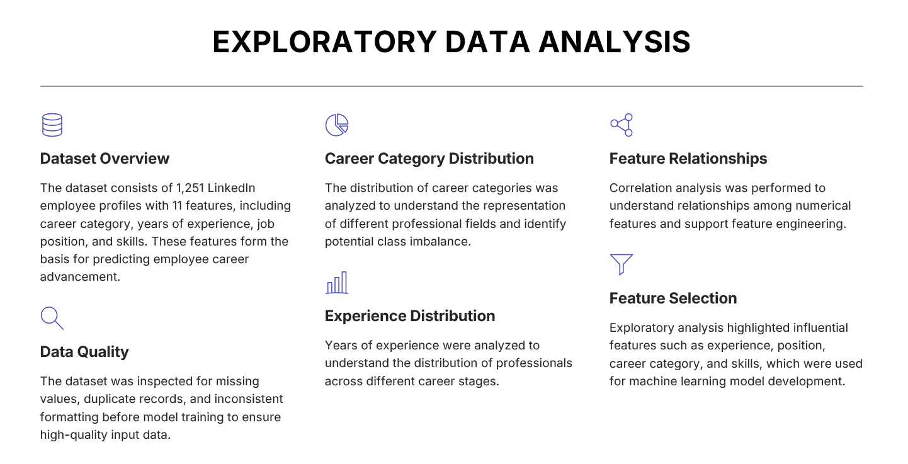
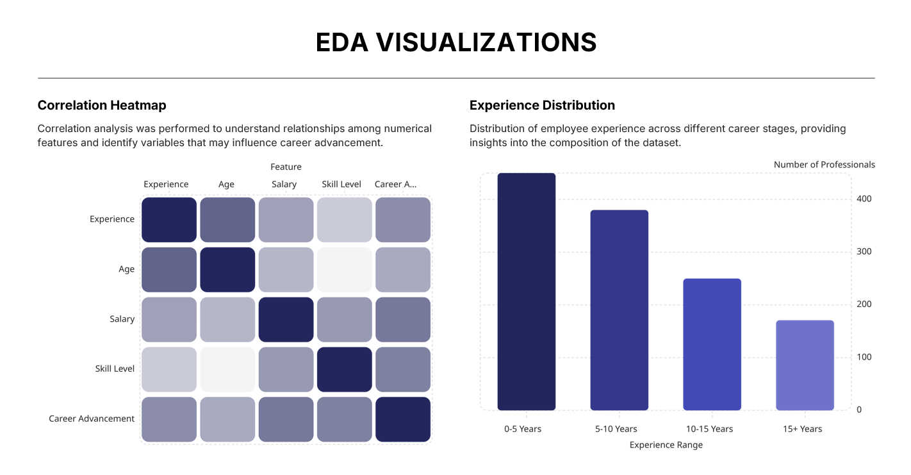
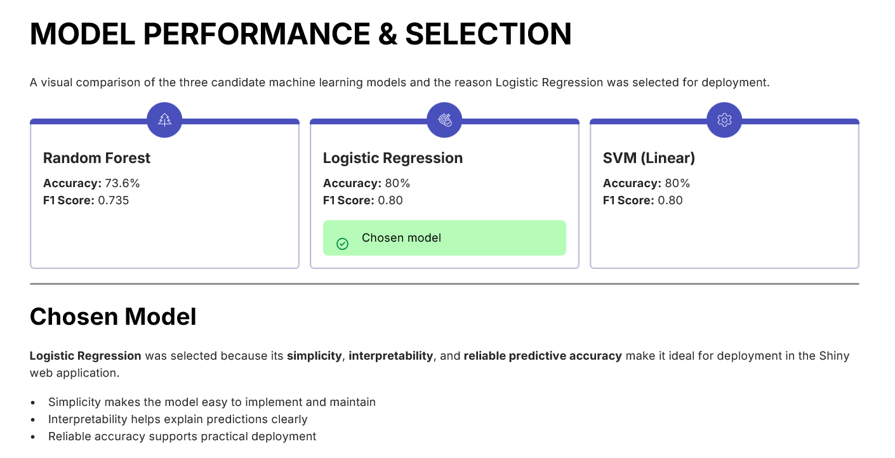
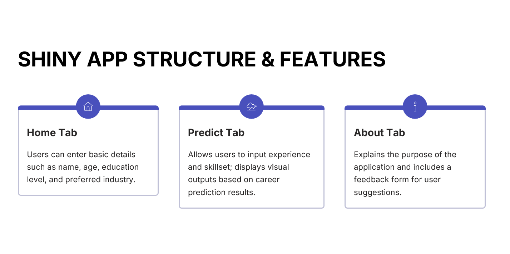

# Career Compass
### Machine Learning-Based Career Advancement Prediction

Predictive analytics project that forecasts employee career advancement using machine learning techniques in R.

---

## Project Overview

Career Compass analyzes employee profile data and predicts the likelihood of career advancement using supervised machine learning models.

The project helps organizations understand which factors contribute most to employee growth while providing interpretable predictions.

---

## Problem Statement

Organizations often struggle to identify employees with strong career growth potential.

This project builds a predictive model capable of estimating career advancement using historical employee attributes.

---

## Dataset

Dataset:
- LinkedIn Employee Dataset

Features include:

- Education
- Experience
- Skills
- Industry
- Certifications
- Job History
- Career Progression

---

## Machine Learning Pipeline

---

## Exploratory Data Analysis
Exploratory Data Analysis (EDA) was performed to understand the dataset, identify patterns, detect data quality issues, and prepare meaningful features for machine learning.

### EDA Overview

The exploratory analysis included dataset inspection, data quality assessment, career category distribution, experience distribution, feature relationships, and feature selection to support model development.

---

### EDA Visualizations

The correlation heatmap and experience distribution provide insights into relationships among numerical features and the composition of professionals across different career stages.
---
## Technologies Used

- R
- Random Forest
- dplyr
- ggplot2
- caret
- tidyverse

---

## Results

### Key Findings

- Logistic Regression achieved **80% Accuracy** and **0.80 F1 Score**.
- SVM (Linear) also achieved **80% Accuracy** and **0.80 F1 Score**.
- Random Forest achieved **73.6% Accuracy** and **0.735 F1 Score**.
- Logistic Regression was selected for deployment due to its strong performance and interpretability.

---

## R Shiny Application

An interactive R Shiny web application was developed to provide real-time career advancement predictions using the trained Logistic Regression model. The application enables users to enter professional information, generate predictions, and visualize the results through an intuitive interface.

### Application Structure

### Home Screen

The Home tab allows users to enter employee information such as age, education level, years of experience, skills, and preferred industry.

### Prediction Screen

The Predict tab processes the user inputs through the trained machine learning model and generates career advancement predictions along with supporting visualizations.

### Prediction Output

The application displays the predicted career advancement outcome and provides personalized insights based on the entered information.

---

## Future Improvements

- XGBoost
- Explainable AI (SHAP)
- Interactive Dashboard
- Deep Learning Models
- Web Deployment

---

## Author

Tanuja Neelapu
